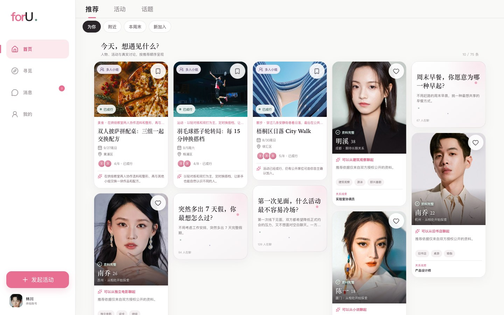
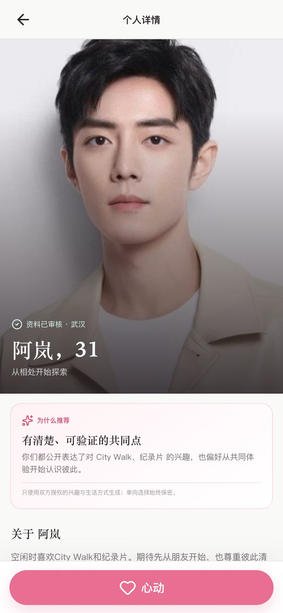
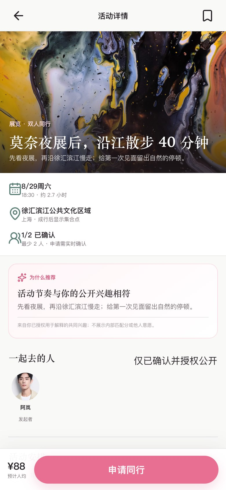
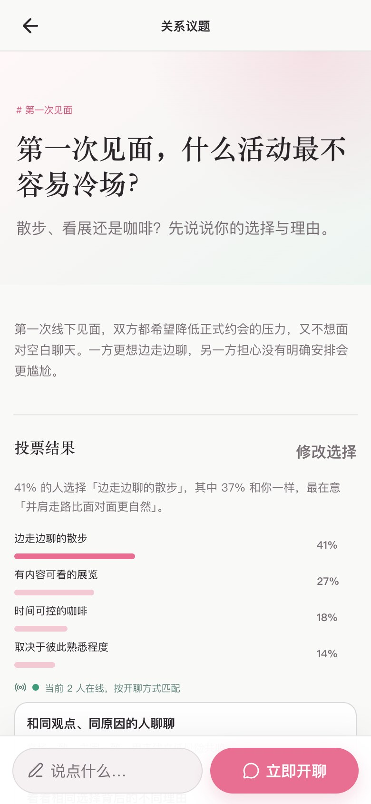
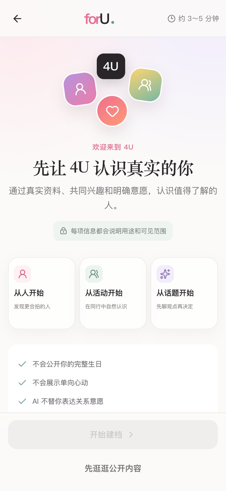
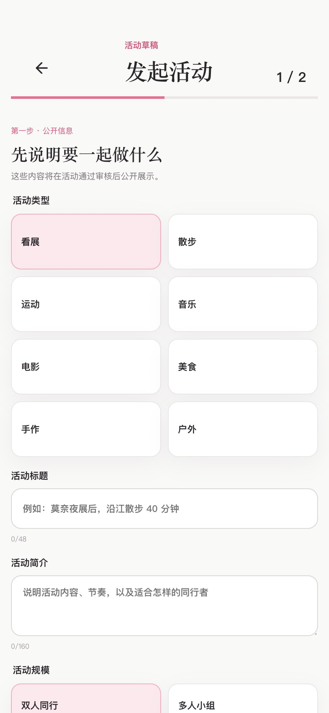

# for U · 4U

### 从共同兴趣、一场活动和一次真诚对话开始认识彼此

4U 是一款面向成年用户的社交发现产品原型。

在这里，你不必只凭一张照片做决定：可以先了解共同兴趣，加入一场具体活动，或从一个真正想聊的话题开始。

[立即体验 4U](https://happyeye1.github.io/4U/)

## 认识，不止一种方式

4U 把人物、活动和话题放在同一条探索路径中。先找到共同点，再决定要不要继续靠近。

<table>
  <tr>
    <td width="33%" align="center"></td>
    <td width="33%" align="center"></td>
    <td width="33%" align="center"></td>
  </tr>
  <tr>
    <td align="center"><strong>发现一个人</strong> 从公开兴趣、生活方式和关系意图了解彼此；心动只对自己可见。</td>
    <td align="center"><strong>加入一场活动</strong> 先看清时间、区域、人数和参与规则，再决定是否同行。</td>
    <td align="center"><strong>先聊一个话题</strong> 表达立场与理由，在有限资料下交流，聊得来再继续认识。</td>
  </tr>
</table>

## 从第一次打开，到建立连接

<table>
  <tr>
    <td width="33%" align="center"></td>
    <td width="33%" align="center"></td>
    <td width="33%" align="center"></td>
  </tr>
  <tr>
    <td align="center"><strong>先了解，再建档</strong> 可以先浏览公开内容，也可以用约 3～5 分钟逐步建立资料。</td>
    <td align="center"><strong>连接集中管理</strong> 匹配、活动房间和通知分开呈现，关系状态一目了然。</td>
    <td align="center"><strong>发起一次见面</strong> 分两步说明活动内容与参与规则，保存草稿后再提交审核。</td>
  </tr>
</table>

## 你可以体验

### 首次建档

- 可以先以游客身份浏览，也可以用约 3～5 分钟完成引导式建档
- 依次设置账号、成年信息、身份、交往偏好、兴趣、照片和个人表达
- 分别确认 AI 推荐用途与资料公开范围，提交前预览他人可见内容

### 发现

- 在人物、活动和话题组成的综合推荐流中探索，下滑时自动加载更多内容
- 按附近、本周末、新加入、活动类型和关系意图筛选
- 搜索活动、用户或话题，并直接进入对应详情
- 从详情返回后继续原来的推荐顺序、阅读位置和浏览进度

### 人物与心动

- 查看公开照片、年龄、城市、职业、兴趣和关系意图
- 通过“为什么推荐”了解可见的共同点
- 私密表达心动，也可以随时撤回
- 第一次心动前先了解隐私规则，避免把单向意愿误解为匹配

### 活动

- 查看时间、公开区域、费用、人数、活动流程和安全说明
- 区分双人同行、多人小组、直接加入、申请加入、候补与匹配成行
- 收藏感兴趣的活动，体验申请确认与防重复申请
- 用两步表单发起活动，在当前设备保存并恢复草稿
- 提交后先进入审核，而不是直接公开招募

### 话题与讨论

- 对关系议题先选择立场，再说明最主要的理由
- 查看投票结果，并按“同观点同原因”“同观点不同原因”“不同观点但共享价值”开启讨论
- 在关系议题投票后发表评论、回复和点赞
- 进入限时讨论房，先在有限资料下交流，双方愿意后再解锁更多信息

### 消息与个人空间

- 分别查看匹配会话、活动房间和状态通知
- 在普通聊天、活动会话和话题讨论中主动发送消息
- 查看自己的公开资料、关系意图、收藏、申请、草稿和权限说明
- 在离线、空内容、加载失败或图片不可用时获得清楚的状态提示

## 有边界的连接

- 首次打开不会自动创建资料，也可以先以游客身份浏览公开内容
- 建档过程中，每项信息都会说明用途和可见范围
- 完整生日不会公开，单向心动不会展示给对方
- 话题讨论先展示有限资料，双方都愿意后才解锁更多信息
- 活动公开页只展示大致区域；精确集合点只面向确认参与者
- 系统可以提供开场提示，但不会代替你发送消息或表达关系意愿
- 申请不等于占座，提交审核不等于发布，活动灵感也不等于已经成行

## 关于在线演示

当前在线版本是可交互的产品原型。

你可以实际操作浏览、筛选、搜索、收藏、心动、投票、评论、表单和页面内消息；人物资料、活动、话题、在线人数、匹配对象、消息状态、审核结果和通知均为演示内容，不会连接真实用户，也不会产生真实报名、聊天或安全处置。

人物昵称、年龄、职业、兴趣和经历均为虚构。演示头像来自公开图片素材，仅用于界面效果展示，不代表图片中的人物注册、使用或认可 4U。

---

**先有共同的事，再有想认识的人。**

